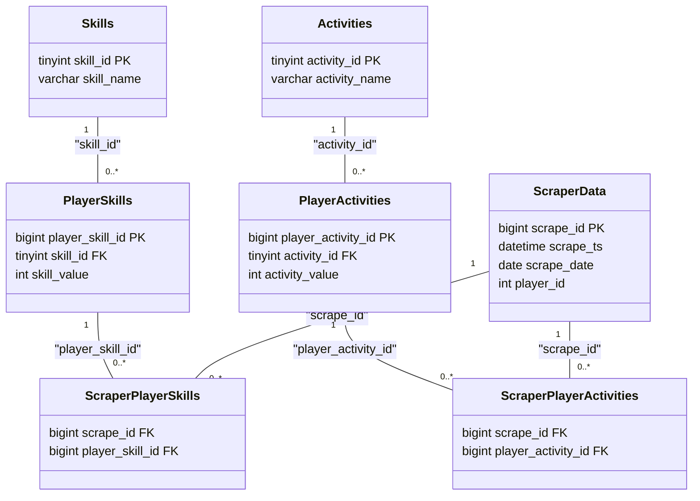

```mermaid
classDiagram
    class Skills {
        tinyint skill_id PK
        varchar skill_name
    }

    class Activities {
        tinyint activity_id PK
        varchar activity_name
    }

    class PlayerSkills {
        bigint player_skill_id PK
        tinyint skill_id FK
        int skill_value
    }

    class PlayerActivities {
        bigint player_activity_id PK
        tinyint activity_id FK
        int activity_value
    }

    class ScraperData {
        bigint scrape_id PK
        datetime scrape_ts
        date scrape_date
        int player_id
    }

    class ScraperPlayerSkills {
        bigint scrape_id FK
        bigint player_skill_id FK
    }

    class ScraperPlayerActivities {
        bigint scrape_id FK
        bigint player_activity_id FK
    }

    Skills "1" -- "0..*" PlayerSkills : "skill_id"
    Activities "1" -- "0..*" PlayerActivities : "activity_id"
    PlayerSkills "1" -- "0..*" ScraperPlayerSkills : "player_skill_id"
    PlayerActivities "1" -- "0..*" ScraperPlayerActivities : "player_activity_id"
    ScraperData "1" -- "0..*" ScraperPlayerSkills : "scrape_id"
    ScraperData "1" -- "0..*" ScraperPlayerActivities : "scrape_id"

```