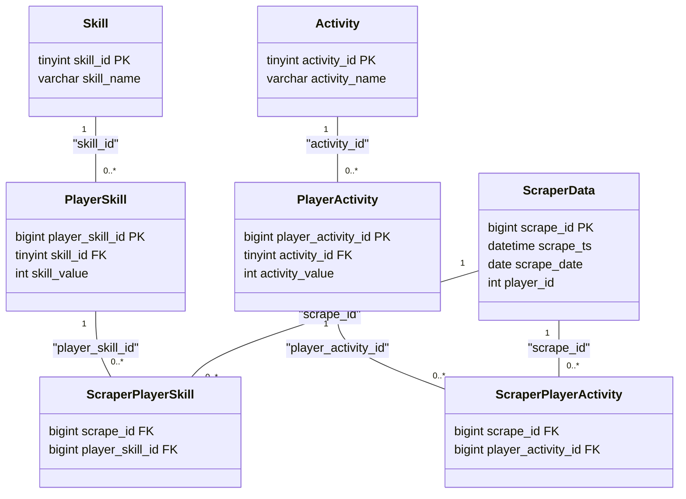

```mermaid
classDiagram
    class Skill {
        tinyint skill_id PK
        varchar skill_name
    }

    class Activity {
        tinyint activity_id PK
        varchar activity_name
    }

    class PlayerSkill {
        bigint player_skill_id PK
        tinyint skill_id FK
        int skill_value
    }

    class PlayerActivity {
        bigint player_activity_id PK
        tinyint activity_id FK
        int activity_value
    }

    class ScraperData {
        bigint scrape_id PK
        datetime scrape_ts
        date scrape_date
        int player_id
    }

    class ScraperPlayerSkill {
        bigint scrape_id FK
        bigint player_skill_id FK
    }

    class ScraperPlayerActivity {
        bigint scrape_id FK
        bigint player_activity_id FK
    }

    Skill "1" -- "0..*" PlayerSkill : "skill_id"
    Activity "1" -- "0..*" PlayerActivity : "activity_id"
    PlayerSkill "1" -- "0..*" ScraperPlayerSkill : "player_skill_id"
    PlayerActivity "1" -- "0..*" ScraperPlayerActivity : "player_activity_id"
    ScraperData "1" -- "0..*" ScraperPlayerSkill : "scrape_id"
    ScraperData "1" -- "0..*" ScraperPlayerActivity : "scrape_id"
```